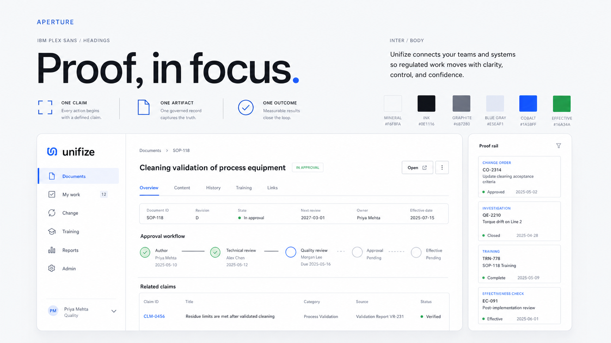
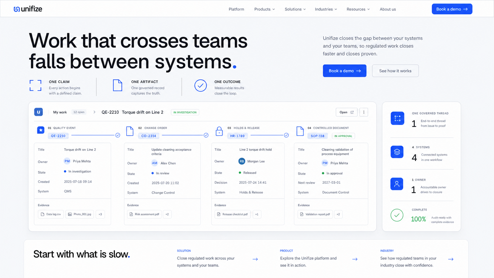
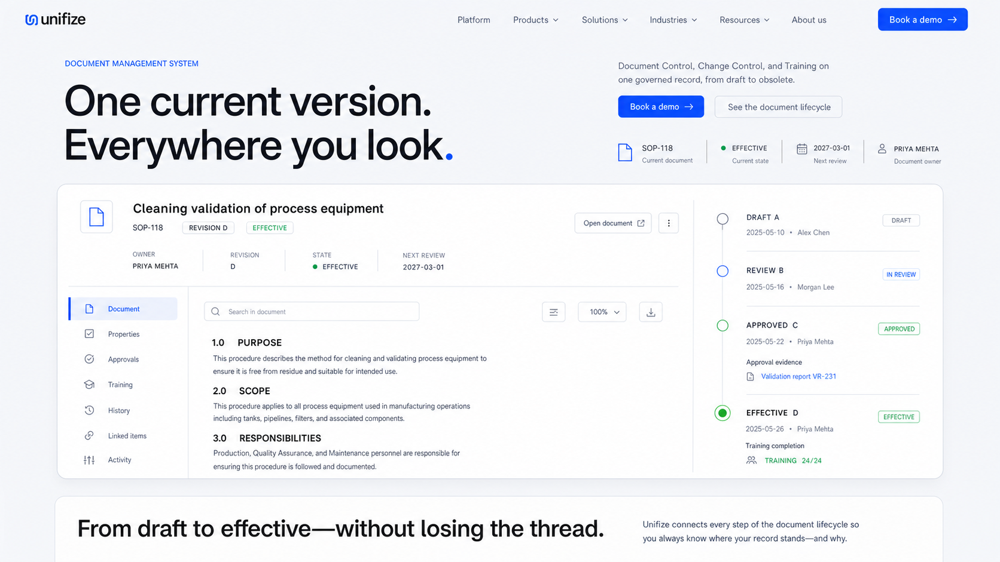
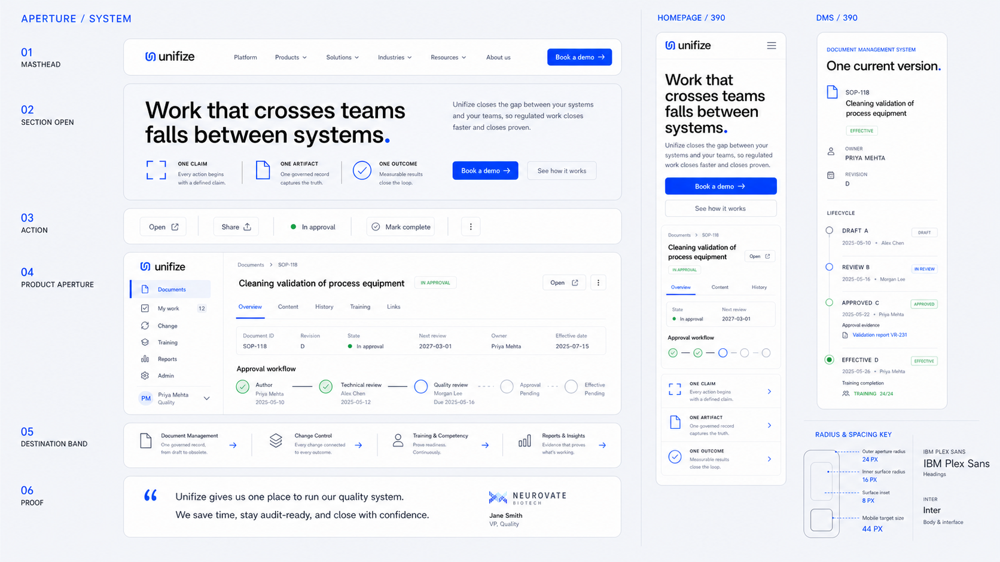

# Unifize Aperture mood board

Working direction: **Aperture**  
System principle: **one claim, one governed artifact, one measurable outcome**

These generated images are north-star references, not production screenshots.
Production product imagery should use real React surfaces or approved product
captures with accessible HTML.

## 01 — Visual language

The system in one frame: IBM Plex Sans headings, Inter body and interface text,
mineral-white space, sparse cobalt, softly concentric product surfaces, and a
narrow proof rail.

## 02 — Homepage north star

The homepage opening changes from a centered dark hero and tabbed browser mockup
to an asymmetric claim, one cross-system governed thread, a compact outcome
rail, and a horizontal destination band.

## 03 — DMS north star

DMS uses the same visual grammar but a different information model: a single
controlled document and its Draft → Review → Approved → Effective lifecycle
share one integrated product surface.

## 04 — System architecture and responsive behavior

The reusable primitives are shown beside 390 px homepage and DMS adaptations:
masthead, section open, action pair, product aperture, destination band, proof,
and the 24 / 16 / 8 concentric surface key.

## Reference inputs

- [Current homepage](references/homepage-current.jpg)
- [Current DMS page](references/dms-current.jpg)

The reference screenshots were used only for approved messaging, Unifize
cobalt, regulated-work product nouns, and authentic UI density. Their centered
dark layout, gradient text, large blue stages, and browser-window presentation
were explicitly excluded.

## Generation mode

All four boards were generated with the built-in ImageGen workflow using the
ui-mockup taxonomy. No CLI or API fallback was used.

## Final prompt set

### Shared direction

Create an original Unifize website direction named “Aperture” around the
principle “one claim, one governed artifact, one measurable outcome.” Use IBM
Plex Sans only for headings and display text, and Inter only for body and
interface text. Use a cool mineral-white canvas, white product surfaces,
near-black ink, graphite, quiet blue-gray, sparse Unifize cobalt, and restrained
effective green. Use a buildable 12-column layout, large softly rounded product
apertures, minimal layered shadow, and pure-black 10% image outlines. Product UI
must show real workflow nouns, owners, states, evidence, revisions, and dates.
Keep cobalt below 8% of the composition.

Avoid dark heroes, centered copy, gradient text, full-blue stages, traffic-light
browser chrome, tabbed hero selectors, bento card walls, glass, glow, 3D
perspective, floating devices, node clouds, stock imagery, ledger/newspaper
styling, copied Apple or Linear layouts, third-party logos, and watermarks.

### 01 — Visual language

Create a 16:9 design-system board. Show the exact display line “Proof, in
focus.”, IBM Plex Sans and Inter specimens, a restrained palette, the three
principles One claim / One artifact / One outcome, and one dominant governed
document surface beside a slim proof rail. Use an asymmetric composition and do
not expose the underlying grid as decoration.

### 02 — Homepage

Create a 16:9 desktop homepage opening. Preserve the approved headline “Work
that crosses teams falls between systems.” Place it across the upper-left seven
columns and place the lede and actions in the upper-right four columns. Below,
show one governed thread spanning quality event, change order, holds and
release, and controlled document across ten columns; use the remaining two
columns for outcome metrics. Reveal “Start with what is slow.” and three
horizontal Solution / Product / Industry destination bands at the bottom edge.

### 03 — DMS

Create a 16:9 DMS product-page opening. Preserve “One current version.
Everywhere you look.” Use a seven/four-column opening and then one integrated
full-width DMS product aperture. The left side shows the SOP-118 controlled
document workspace with owner, revision, effective state, next review, and
document content. The right side shows Draft A / Review B / Approved C /
Effective D and Training 24/24. Reveal “From draft to effective—without losing
the thread.” at the bottom.

### 04 — System architecture

Create a 16:9 practical design-system specimen. In the left eight columns, show
the canonical masthead, section open, action pair, product aperture, destination
band, and customer proof. In the right four columns, show flat 390 px homepage
and DMS crops without device hardware. Include the 24 px outer radius / 16 px
inner radius / 8 px inset / 44 px target key.

Targeted correction prompt: change only the DMS / 390 crop so it uses SOP-118,
Cleaning validation of process equipment, Revision D, Effective, Priya Mehta,
and the Draft A / Review B / Approved C / Effective D lifecycle with Training
24/24. Preserve every other element of the system board.

## Interpretation rules

Treat these characteristics as binding:

- light-first asymmetric compositions;
- IBM Plex Sans for headings and Inter for everything else;
- one dominant product object per chapter;
- cobalt reserved for action, focus, active state, and brand punctuation;
- 24 / 16 / 8 concentric surface geometry;
- authentic product evidence instead of decorative SaaS graphics;
- homepage proof rail and DMS lifecycle rail as related but distinct patterns;
- mobile reading order that keeps owner, state, evidence, revision, and date.

Treat generated small copy, names, dates, company marks, and product pixels as
placeholders.
