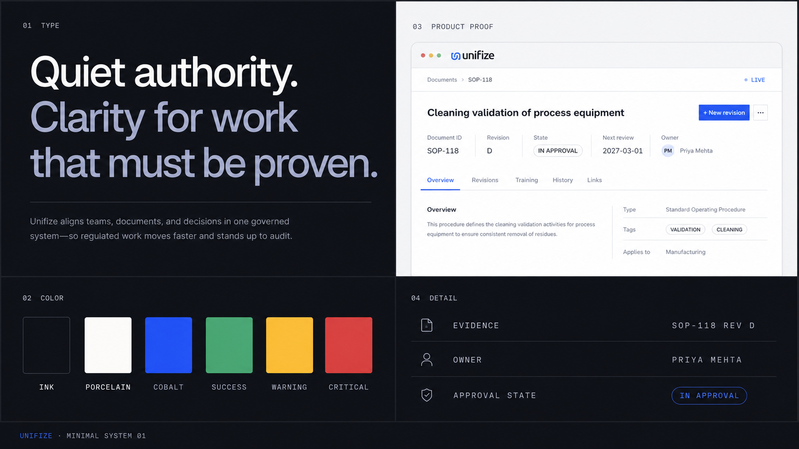
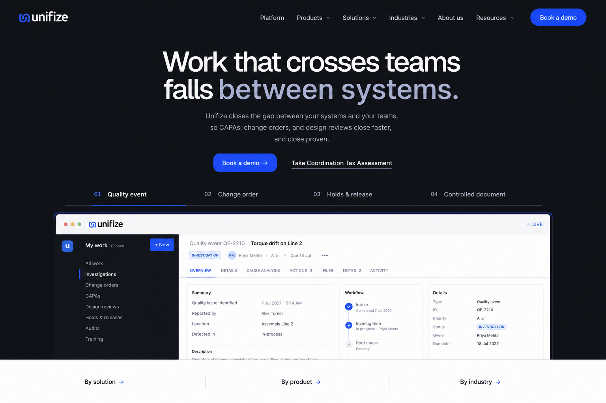
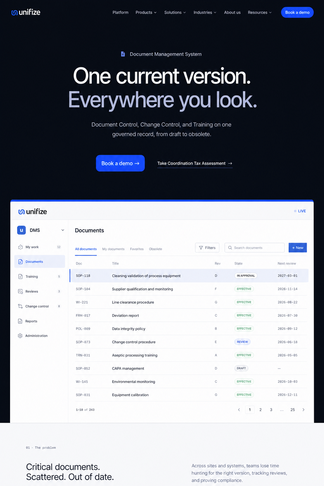
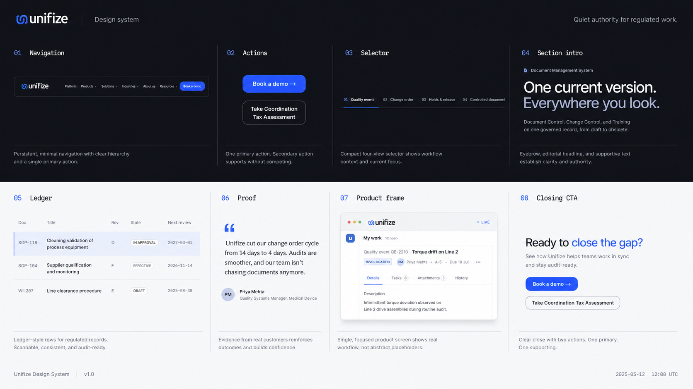
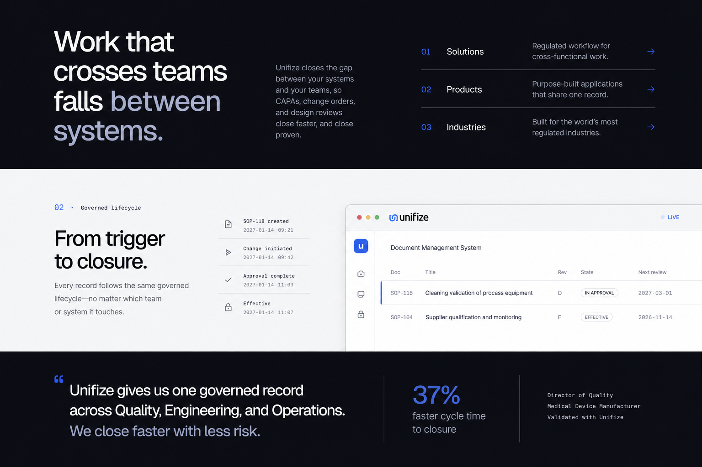

# Unifize minimal-system mood board

Working direction: **Quiet authority**.

These generated images are design references, not production screenshots or
assets. Production product imagery should continue to use the real React mock
components or approved product captures.

## 01 · Visual language

The core balance: dark editorial thesis, porcelain proof surface, cobalt action,
compact evidence metadata, and one legible product object.

## 02 · Homepage north star

L1 pattern: thesis, one primary action, compact workflow selector, one product
screen, then immediate ingress to solutions, products, and industries.

## 03 · DMS north star

L2 pattern: specific product outcome, one representative DMS screen, then the
first problem chapter. The product page uses the homepage skeleton without the
homepage's multi-destination routing burden.

## 04 · Components and surfaces

The canonical component family across dark and light contexts. Cobalt is
reserved for primary actions and active state.

## 05 · Editorial storytelling

Three repeatable composition modes: L1 ingress, L2 mechanism, and outcome proof.
They share type alignment, grid, numbering, and evidence language.

## Prompt set

All five images were generated with the built-in ImageGen workflow using the
`ui-mockup` taxonomy. The current homepage and DMS page renders were supplied as
reference images. Every prompt enforced the same system constraints:

- near-black and porcelain surfaces;
- existing Unifize cobalt used on less than 10% of the composition;
- Geist-like display, Inter-like body, and compact mono evidence text;
- 16-column editorial grid and an 8px rhythm;
- one dominant object per viewport;
- authentic regulated-workflow records and product screens;
- no card walls, glass, glow, gradients, 3D browser tilts, node clouds, or stock
  photography.

The five prompt subjects were: visual-language board, homepage north star, DMS
north star, component specimen board, and L1/L2 editorial storytelling patterns.

