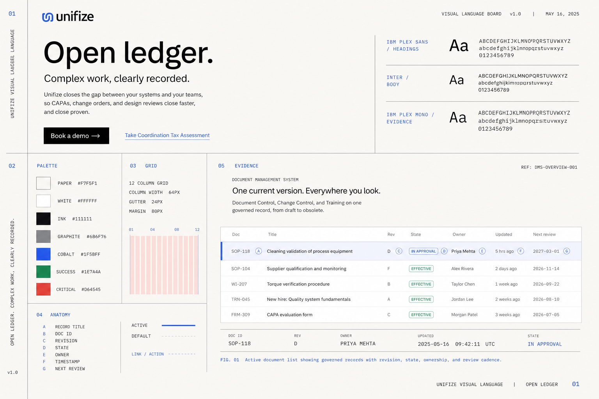
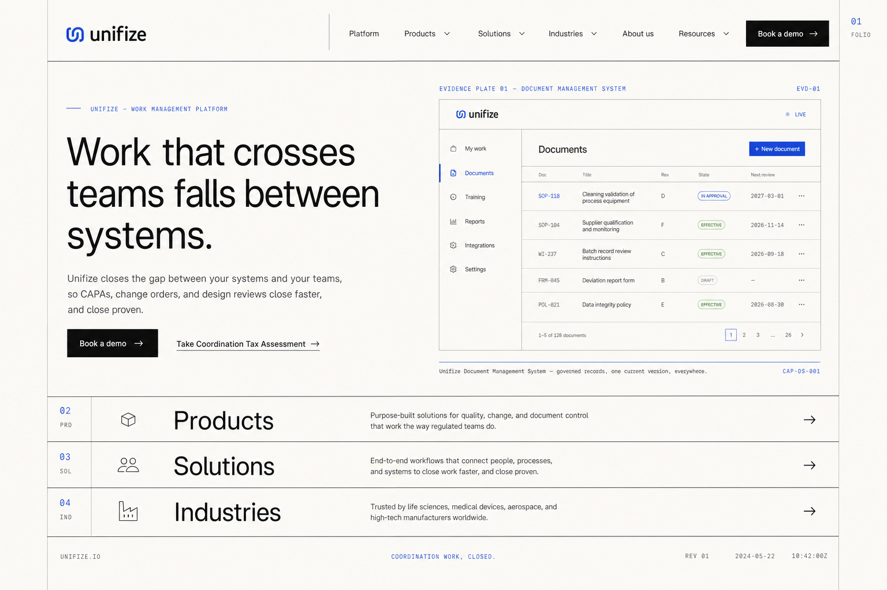
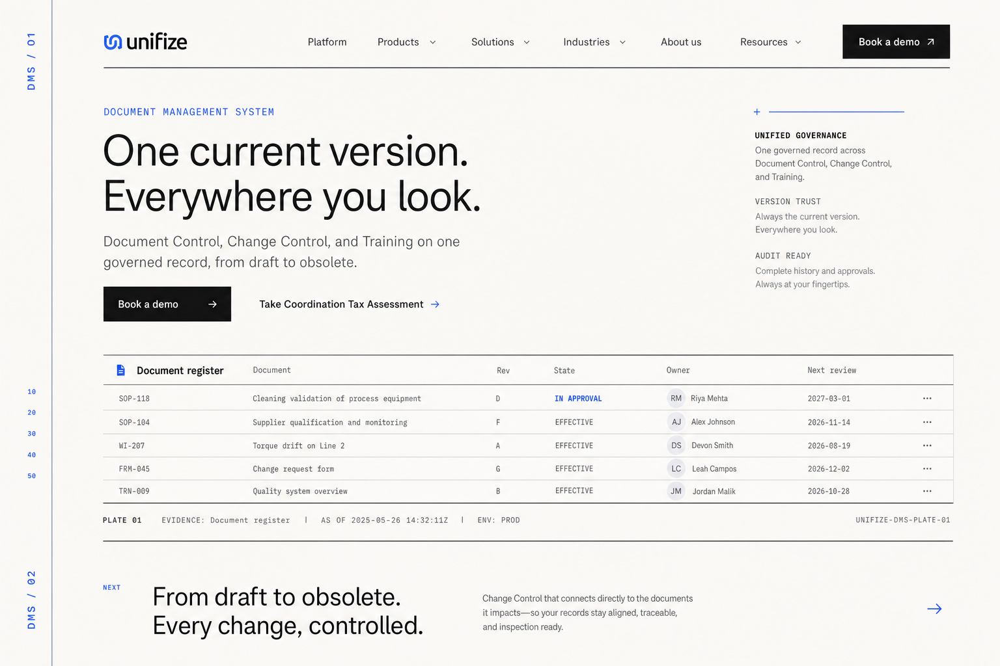
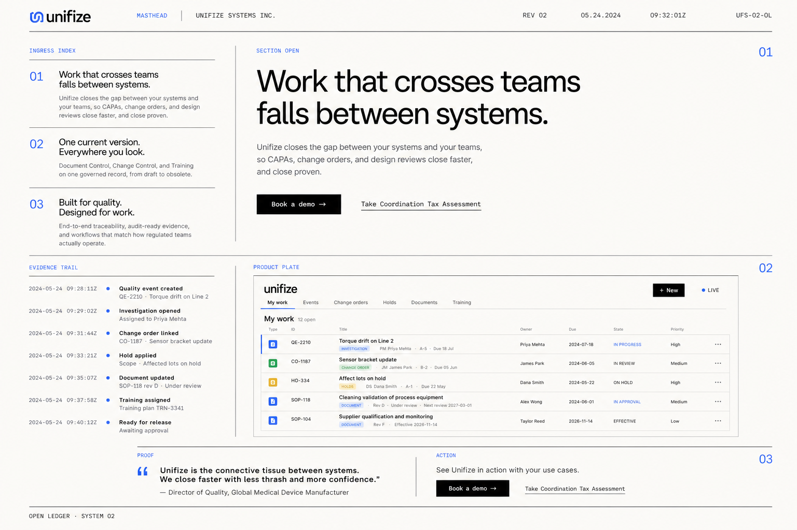

# Open Ledger moodboard

This board is a deliberately different direction for Unifize. The current homepage and DMS page were used only as **content references** for product nouns, interface records, and approved messaging. Their dark surfaces, blue stages, centered compositions, rounded cards, and existing component language were explicitly excluded.

The images are north stars, not production screenshots. Product text should be rebuilt with real UI and accessible HTML rather than copied from generated pixels.

## 01 — Visual language

The system in one frame: IBM Plex Sans display type, Inter body type, IBM Plex Mono evidence, warm paper, thin rules, sparse cobalt, and a flat product record.

## 02 — Homepage north star (L1)

The hero retains a substantial product screen, but the composition changes completely. The proposition is left-aligned and editorial; the product becomes a captioned evidence plate; the lower page opens into an indexed set of ingress routes.

## 03 — DMS north star (L2)

The L2 page uses the same ledger grammar with a product-specific folio, a wide document register, and chapter-based proof. It is visibly part of the same family without repeating the homepage.

## 04 — System architecture

The reusable primitives: masthead, ingress index, section open, evidence trail, product plate, proof, and action. Relationships are expressed through alignment, rules, and whitespace—not cards.

## Prompt set

Generation mode: **OpenAI built-in ImageGen** (`ui-mockup`).  
Reference inputs: the current homepage and DMS screenshots, passed as content references only.

### Shared direction

> Create a radically new Unifize website design-system moodboard called “Open Ledger”: a light-first editorial website that feels like a standards publication crossed with a precise industrial instrument manual. Use IBM Plex Sans exclusively for headings and display type, Inter exclusively for body and interface copy, IBM Plex Mono for evidence metadata, warm paper, black ink, thin graphite rules, sparse cobalt annotations, an asymmetric 12-column grid, and flat product evidence plates. Make it structurally different from the supplied pages. Do not use serif typography. Avoid dark heroes, centered hero copy, gradient text, blue stages, pills, rounded cards, generic SaaS card walls, glass, decorative shadows, 3D objects, node clouds, stock photos, and ornamental diagrams.

### Board-specific prompts

1. **Visual language:** show type specimens, palette proportions, grid keys, evidence metadata, and one product record.
2. **Homepage:** preserve the approved proposition; place it across the left seven columns, a substantial product screen across the right five columns, and indexed L2 ingress rows below.
3. **DMS:** use a vertical DMS folio, product-specific editorial opening, full-width flat document register, and the beginning of the next chapter.
4. **System architecture:** show the canonical L1/L2 primitives on one coherent publication grid, separated only by whitespace, fine rules, folios, and captions.

## Reading the boards

Treat these characteristics as binding:

- continuous warm-light surface;
- left-aligned editorial hierarchy;
- product screen visible in the homepage opening;
- square actions and flat evidence plates;
- indexes and ledgers instead of card grids;
- cobalt limited to interaction, identity, and state;
- shared L1/L2 chapter grammar.

Treat exact generated copy, small product data, and logo rendering as placeholders. Production implementation must use the actual brand mark, product components, and content source.
