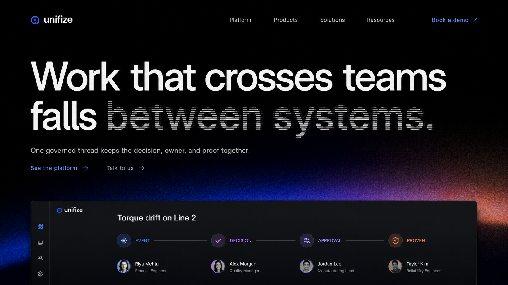
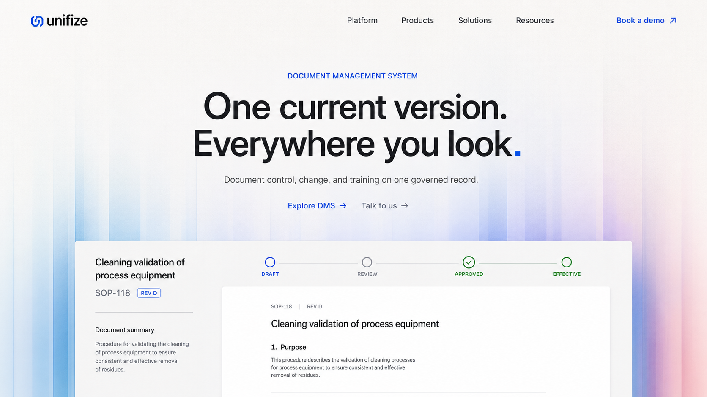

# Unifize Signal Field mood board

This direction supersedes the earlier Aperture explorations.

Signal Field is based on a stronger composition model:

- one dominant typographic statement;
- one atmospheric color field;
- one product surface grounded into the lower edge.

## Homepage

The homepage uses the dark-field mode. The phrase “between systems” carries one
restrained signal-resolution treatment, while the cross-system product thread
rises from the color horizon.

## DMS

DMS uses the light-field mode. Broad translucent color bands establish depth,
and the controlled-document product surface is integrated into the bottom of
the viewport.

## Research references

- [Interfere](https://interfere.com/)
- [Mixpanel](https://mixpanel.com/home/)
- [Atlassian Teamwork Graph](https://teamworkgraph.com/)
- [Ona](https://ona.com/)

The references supplied the following principles, not visual templates:

- Interfere: near-black typographic field, one disrupted phrase, low color
  horizon;
- Mixpanel: concise headline and broad architectural color;
- Teamwork Graph: the product idea expressed through the typography itself;
- Ona: atmospheric field and a grounded product capture.

No reference brand marks, proprietary typefaces, page layouts, or illustrations
are reproduced.

## Generation mode

Both images were generated with the built-in ImageGen workflow using the
ui-mockup taxonomy. The four supplied websites were passed as style references;
the current Unifize homepage and DMS screenshots were passed as content
references.

## Final prompt set

### Shared prompt

Create an original Unifize campaign-led website system called “Signal Field”.
Use IBM Plex Sans for all headings and Inter for body and interface text. Build
each opening from one dominant typographic statement, one atmospheric field,
and one wide product surface grounded into the bottom edge. Keep product UI
legible but focused on one workflow. Do not use a white split hero, detached
floating cards, bento grids, multiple screenshots, pill navigation, browser
chrome, gradient-filled headline text, glass, generic node networks, or 3D
device perspective.

### Homepage prompt

Use a full-bleed near-black field. Set “Work that crosses teams / falls between
systems.” at extreme IBM Plex Sans scale. Apply a restrained scanline resolution
effect only to “between systems.” Concentrate cobalt, violet, and a small oxide
glow at the lower horizon. Ground one dark cross-system product screen into that
horizon, showing Event → Decision → Approval → Proven.

### DMS prompt

Use a full-bleed warm mineral-white field. Set “One current version. /
Everywhere you look.” at large centered IBM Plex Sans scale with one cobalt
square punctuation marker. Introduce broad translucent ice-blue, cobalt, violet,
and rose bands in the lower half. Ground one white DMS surface into the bottom,
showing SOP-118, Revision D, a concise Draft → Review → Approved → Effective
path, and one document preview.

## Production note

These are art-direction references. Production typography, product UI, logos,
copy, accessibility, and responsive behavior must be rebuilt in code.
